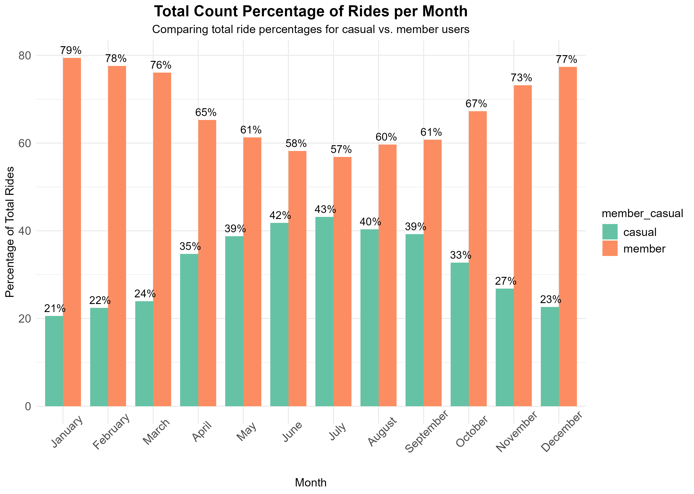
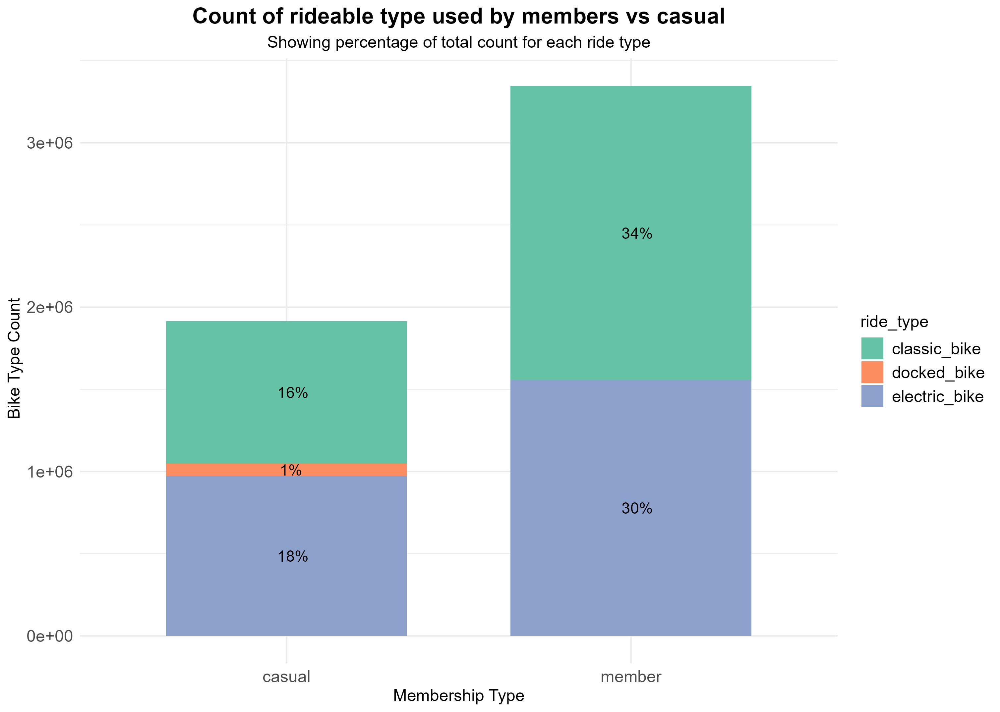

# **Case Study for bike-share fictional company**

<p>

This public repository is to share the completition of the capstone
project for the **Google Data Analytics Professional course**. In this
project the goal is to demonstrate the skills learned and go through the
six steps for data analytics: <ins>ask, prepare, process, analyze, share
and act. <ins>

<p>

# Scenario

You are a junior data analyst working on the marketing analyst team at
Cyclistic, a bike-share company in Chicago. The director of marketing
believes the company’s future success depends on maximizing the number
of annual memberships. Therefore, your team wants to understand how
casual riders and annual members use Cyclistic bikes differently. From
these insights, your team will design a new marketing strategy to
convert casual riders into annual members. But first, Cyclistic
executives must approve your recommendations, so they must be backed up
with compelling data insights and professional data visualizations.

------------------------------------------------------------------------

# About the company

In 2016, Cyclistic launched a successful bike-share offering. Since
then, the program has grown to a fleet of 5,824 bicycles that are
geotracked and locked into a network of 692 stations across Chicago. The
bikes can be unlocked from one station and returned to any other station
in the system anytime. Until now, Cyclistic’s marketing strategy relied
on building general awareness and appealing to broad consumer segments.
One approach that helped make these things possible was the flexibility
of its pricing plans: single-ride passes, full-day passes, and annual
memberships. Customers who purchase single-ride or full-day passes are
referred to as casual riders. Customers who purchase annual memberships
are Cyclistic members. Cyclistic’s finance analysts have concluded that
annual members are much more profitable than casual riders. Although the
pricing flexibility helps Cyclistic attract more customers, the director
of Marketing, Lily Moreno, believes that maximizing the number of annual
members will be key to future growth. Rather than creating a marketing
campaign that targets all-new customers, Moreno believes there is a
solid opportunity to convert casual riders into members. She notes that
casual riders are already aware of the Cyclistic program and have chosen
Cyclistic for their mobility needs.

------------------------------------------------------------------------

# Steps

## 1. Ask

**Business Task:** Design marketing strategies aimed at converting
casual riders into annual members. In order to do that, the team needs
to better understand: <br> 1. How do annual members and casual riders
use Cyclistic bikes differently? <br> 2. Why would casual riders buy
Cyclistic annual memberships? <br> 3. How can Cyclistic use digital
media to influence casual riders to become members? <br>

------------------------------------------------------------------------

## 2. Prepare

**Data Source:**
[divvy-tripdata](https://divvy-tripdata.s3.amazonaws.com/index.html)
Note that the data has been made available by Motivate International
Inc. under this
[<ins>license</ins>](https://www.divvybikes.com/data-license-agreement).

This data source has been confirmed to follow the ROCC as a reliable,
original, comprehensive, current and cited. The data used for this study
covers the bike rides from **January through December 2023**

------------------------------------------------------------------------

## 3. Process

**Tools:** <br>

1.  Data cleaning: Excel Power Query and Pivot Tables<br>

-   Used Excel PowerQuery to join 2023 months, removed columns that will
    not be needed in the study. <br>
-   While filtering and calculating trip lengths, a set of records had
    negative trip duration time which were removed.<br>
-   Removed columns related to station start and end, start and end
    time, and coordinate columns <br>
-   Based on start date: Added new columns for "month" and "weekday"
-   Kept columns: member_casual, rideable_type, month, weekday,
    trip_length.
-   Spreadsheets had to be divided by quarters due to exceeding maximum
    number of rows allowed in Excel.
-   Created another spreadsheet to add a column to group trip length in
    4 categories:<br> "under 10 min"", "between 10 to 30 min", "between
    30 to 60 min" and "over 60 min" <br>

2.  Data Combining and Exploration: SQL and Rstudio <br>

-   Used SQL to combine 2023 database that was saved in quarters and
    create new tables with summarized descriptive statistics.
    data.[<ins>Data_combining.sql<ins>](https://github.com/Mvviggi/Bike-Share-case-study/blob/c9f5d591b21cca0ab0665d3d0a07aa930aaabb23/Data_combining.sql)
    <br>

3.  Data visualization - Rstudio and Tableau<br>

-   Used R for importing queried tables to create visualizations for
    analysis and create plots.
    [<ins>Main_final_analysis.R<ins>](https://github.com/Mvviggi/Bike-Share-case-study/blob/e7d1f31158701ba9f0d6f20e29601d3882a68bac/Main_final_analysis.)

<br>

------------------------------------------------------------------------

## 4. Analyze

##### Descriptive statistics table for member vs casual users ride length.

###### **During Processing: The trip length was filtered to only have rides \>= 1 min.**


```{r, echo=FALSE}
desc_stats<- read.csv("https://github.com/Mvviggi/Bike-Share-case-study/blob/75c13265fb9207b459e8fb185a4dda23e4350006/desc_stats.csv")
knitr::kable(desc_stats)
```
#### **Table 1:** Descriptive statistics ride length
| member_casual | mean        | median      | max         | min |
| ------------- | ------------| ----------- | ----------- |-----|
| casual        | 29.82526292	| 12.45       | 8489.06667	| 1   |
| member        | 12.94575369	| 8.816666667	| 1559.666667 | 1   |


#### 1. The table above indicates that the mean trip duration (29.8 minutes) for casual riders is longer than the members (12.9 minutes). <br> 2. As well as the maximum trip duration for casual is 98489 minutes while the maximum ride time for members is 1559 minutes.

<br> 

### Bar plots for mean monthly and day of the week ride time for members vs casual riders

 

#### Figure 1 indicates that casual riders take longer trips on average during spring and summer, whereas members consistently use the bikes throughout the year but for shorter duration. 

<br>


#### Figure 2 indicates that casual riders tend to use bikes more frequently on weekends (Friday through Sunday), while members primarily ride on weekdays.

<br> 

### Bar plot for total rides distributed by month between members and casual riders.

#### **Calculated percentage of rides per month of member vs casual riders.**

```{r, collapse = TRUE, eval = FALSE}
###Calculating Percentage of rides per month member vs casual
# Compute percentage of trips per month

 month_rides_percent <- month_rides %>%  #dataframe for monthly ride counts for members and casual
   group_by(month) %>%
   mutate(percentage = total_trips / sum(total_trips) * 100)


# Plot using ggplot
{monthly_rides_per <- month_rides_percent %>%
  ggplot(aes(x = month, y = percentage, fill = member_casual)) +
  geom_bar(stat = "identity", position = "dodge", width = 0.8) +
  geom_text(aes(label = paste0(round(percentage, 0), "%")),  # Format as percentage
            position = position_dodge(width = 0.7),
            vjust = -0.5, size = 4) +
  labs(
    title = "Total Count Percentage of Rides per Month",
    subtitle = "Comparing total ride percentages for casual vs. member users",
    x = "Month",
    y = "Percentage of Total Rides"
  ) +
  scale_fill_brewer(palette = "Set2") +
  theme_minimal() +
  theme(
    plot.title = element_text(size = 16, face = "bold", hjust = 0.5),
    plot.subtitle = element_text(size = 12, hjust = 0.5),
    strip.text.y = element_text(size = 14, face = "bold"),
    axis.text.x = element_text(size = 12, angle = 45, hjust = 0.5),
    axis.text.y = element_text(size = 12, hjust = 1),
    axis.title = element_text(size = 12),
    legend.title = element_text(size = 12),
    legend.text = element_text(size = 12)
  )
}
```



#### The Figure 3 highlights a clear seasonal trend: <br>

##### 1. Casual riders (green) ride more frequently during the warmer months (spring and summer), peaking in July (43%) and June (42%). This suggests that casual riders are more likely to use the service for recreational purposes, possibly influenced by holidays and vacation periods.

##### 2. Member riders (orange) consistently maintain a higher share of rides throughout the year but see their highest percentages during colder months (fall and winter), such as December (77%), November (73%), and January (79%). This suggests members rely more on the service for regular commuting rather than seasonal leisure.

<br> 

### Stacked bar plot to evaluate the ride bike type used between members and casual



#### The Figure 4 illustrates that in 2023, docked bikes were used exclusively by casual riders, accounting for just 1% of all trips. Electric bikes were used for 40% of the rides throughout the year, while classic bikes made up 50% of the total usage. <br>

<br> <br>

#### *Visualization for analysis of trip ranges* Dashboard is available in [Tableau-dynamic graphs](https://public.tableau.com/app/profile/maria.viggiano/viz/2023bikeShareCapstone/Dashboard1) <br>

##### The Tableau graphs categorized by trip duration ranges validate what has been analyzed in the graphics in this report.

------------------------------------------------------------------------

### 5. Share

#### **Summary analysis:**<br>

1.  Casual riders tend to take longer trips compared to member riders.
    <br>
2.  Member riders have higher count of rides compared to casual
    riders.<br>
3.  Most of the long trips from casual riders occur from Friday through
    Monday (weekends)<br>
4.  Member rides use Cyclistic to ride mostly during the work week. <br>
5.  Overall, the data supports the idea that casual riders are more
    seasonal, while members have a more consistent usage pattern.

------------------------------------------------------------------------

### 6. Act

#### **Conclusion and Recommendations:Based on results and findings**<br>

1.  Riders without membership tend to use the Cyclistic bikes on
    weekends and during warmer seasons, often opting for longer trips.
    Recommendation: <br>
    a.  Launch targeted promotions for new memberships at the end of
        Spring.<br>
    b.  Introduce discounts for riders who use bikes for more than 30
        minutes per trip.
2.  Members typically use the bikes for short trips, with higher usage
    on weekdays, and consistently throughout the year. Recommendation:
    <br>
    a.  Develop referral-based promotions to encourage current members
        to bring in new users, offering a discount for each new
        membership they help generate.
3.  The bike type usage results indicate that the docked bike is the
    least utilized. Recommendation: <br>
    a.  Conduct a survey to gather insights on why docked bikes are less
        popular and ask customers for suggestions on whether increasing
        the availability of classic or electric bikes could help improve
        inventory usage.
